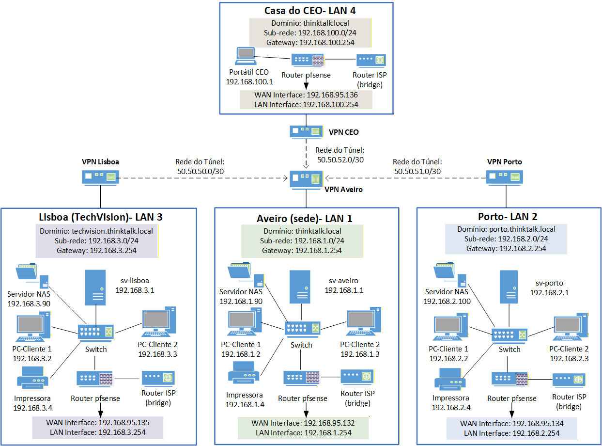

# Enterprise Network Infrastructure Project

## Network Topology

# Enterprise Network Infrastructure Project

## 🇬🇧 Overview

This project consists of the design and implementation of an enterprise network infrastructure, simulating a real-world company environment with centralized services, secure communication, and remote access.

---

## 🔧 Key Features

* pfSense firewall configuration
* VPN implementation:

  * Site-to-site
  * Remote access (road warrior)
* Dynamic routing (RIP)
* Active Directory integration
* Secure internal communication using BeeBEEP
* Web access control using Squid Proxy
* Task automation using PowerShell and Chocolatey
* Group Policy Objects (GPO) for centralized management and security
* Dedicated printers per department (access control)
* Centralized NAS storage for server data

---

## 🧠 Case Study – Real-World Scenario

### Scenario

A company requires a secure and efficient network infrastructure to support internal operations, communication between departments, and remote access for executive staff.

---

### Solution

The implemented solution includes:

* Centralized authentication using Active Directory
* Internal communication using BeeBEEP
* Network protection using pfSense
* Web filtering using Squid Proxy
* Dynamic routing (RIP) for connectivity between network segments
* Secure VPN access for remote users

Each department is isolated in terms of resource access:

* Dedicated printers are assigned per department
* Access to resources is controlled and restricted

A NAS solution is used to:

* store server data
* centralize backups
* improve data availability

---

### Remote Access (CEO Use Case)

A remote access solution was implemented specifically for the company CEO.

The CEO uses a laptop running Fedora and connects securely to the company network when:

* working from home
* traveling

Once connected via VPN:

* full access to internal services is available
* communication with departments is possible
* internal tools operate as if inside the company network

---

### Internal Communication

Communication between departments and locations is handled using BeeBEEP.

Thanks to the integration of VPN and RIP:

* all systems can communicate across the network
* communication remains secure and internal

---

### System Administration & Automation

To improve efficiency, system administration tasks were automated using:

* PowerShell
* Chocolatey

This allows:

* automated software deployment
* system updates
* reduced manual workload for IT

---

### Security & Control

Security is enforced through multiple layers:

* pfSense firewall rules
* Squid Proxy for web filtering
* Group Policy Objects (GPO) to enforce:

  * user restrictions
  * system configurations
  * access control policies

---

## 📊 Project Assets

* Technical Report (209 pages – Portuguese)
* Network Diagram (Visio + image preview)
* Packet Tracer simulation
* Project presentation (PowerPoint)

